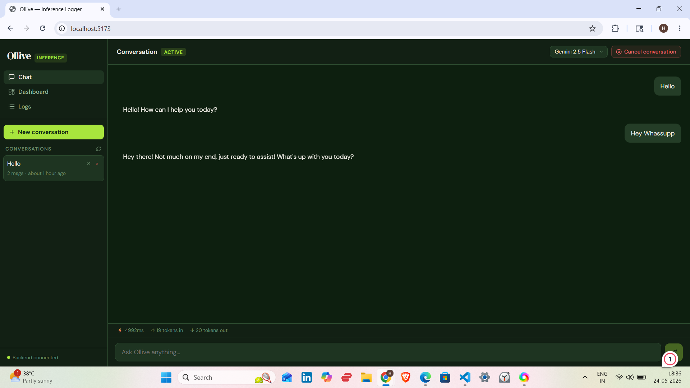
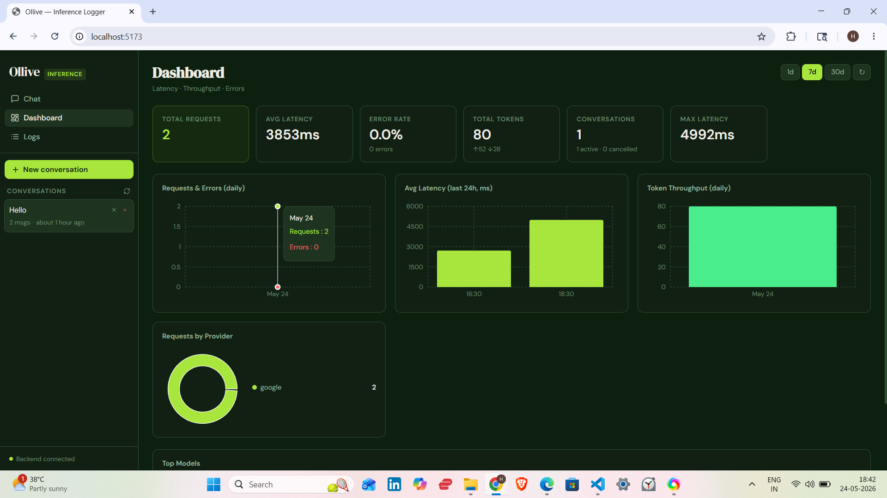
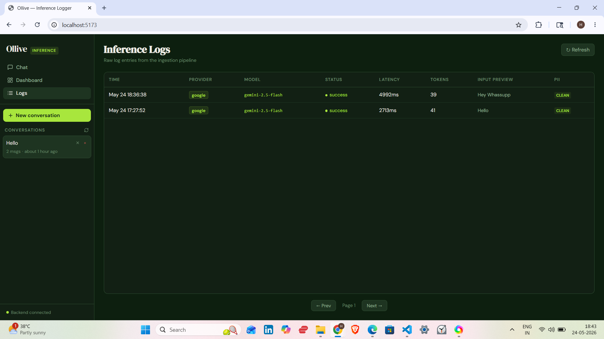

# Ollive Inference Logger

> Lightweight inference logging and ingestion system for LLM applications.


---
## Live Demo

Frontend: [https://your-vercel-url.vercel.app  ](https://ollive-ai-chatbot.vercel.app/)
Backend:[ https://your-render-url.onrender.com](https://ollive-ai-chatbot.onrender.com/)
## Features
---

## Screenshots

### Chat Interface


- Multi-turn streaming chat
- Resume conversations
- Cancel conversations
- Token + latency metrics

---

### Dashboard



- Latency charts
- Throughput analytics
- Error monitoring
- Provider/model breakdown

---

### Logs View



- Raw inference logs
- Metadata inspection
- Streaming request tracking
- Error visibility

---
- **Multi-turn chatbot** with streaming responses (SSE)
- **Inference SDK** — captures model, provider, latency, tokens, timestamps, errors
- **Ingestion pipeline** — validates, parses, PII-redacts, stores logs
- **SQLite database** with sensible schema (conversations → messages → inference_logs)
- **Dashboard** — Latency, Throughput, and Error charts (daily + hourly)
- **Logs view** — raw log table with pagination
- **Conversation management** — list, create, resume, cancel, delete
- **PII redaction** — strips emails, phones, SSNs, credit cards, IPs before storage
- **Docker Compose** — one-command setup
- **Streaming responses** via Server-Sent Events

---

## Quick Start

### Option A: Docker Compose (recommended)

```bash
git clone <your-repo-url>
cd ollive-inference-logger

cp .env.example .env
# Edit .env and set GEMINI_API_KEY=sk-ant-...

docker compose up --build
```

Open **http://localhost:5173** — done.

---

### Option B: Local development

**Backend**
```bash
cd backend
cp .env.example .env        # Set GEMINI_API_KEY
npm install
npm run dev                 # Runs on :3001
```

**Frontend**
```bash
cd frontend
npm install
npm run dev                 # Runs on :5173, proxies /api → :3001
```

---
## Architecture Overview

```
┌──────────────────────────────────────────────────────────┐
│                    Browser (React SPA)                    │
│  ┌──────────┐  ┌──────────────┐  ┌────────────────────┐  │
│  │ Sidebar  │  │  ChatView    │  │  Dashboard / Logs  │  │
│  │ (conv    │  │  (SSE stream)│  │  (metrics / table) │  │
│  │  list)   │  └──────┬───────┘  └──────────┬─────────┘  │
│  └──────────┘         │                     │            │
└─────────────────────── │─────────────────────│────────────┘
                         │ POST /api/chat/stream│ GET /api/metrics
                         ▼                     ▼
┌──────────────────────────────────────────────────────────┐
│                   Express Backend (:3001)                  │
│                                                           │
│  /api/chat/stream  ── streams SSE tokens from Gemini  │
│  /api/conversations── CRUD (list, get, create, cancel)   │
│  /api/logs         ── ingest + query inference logs       │
│  /api/metrics      ── aggregated analytics queries        │
│                                                           │
│  ┌──────────────┐  ┌─────────────┐  ┌─────────────────┐  │
│  │  PII Service │  │  Zod Schema │  │  Rate Limiter   │  │
│  │  (redact)    │  │  (validate) │  │  (300 req/min)  │  │
│  └──────────────┘  └─────────────┘  └─────────────────┘  │
│                                                           │
│  ┌────────────────────────────────────────────────────┐  │
│  │              SQLite (better-sqlite3)                │  │
│  │  conversations → messages → inference_logs          │  │
│  └────────────────────────────────────────────────────┘  │
└──────────────────────────────────────────────────────────┘
                         │ SSE proxy
                         ▼
              gemini API (gemini-1.5)
```

---

## Schema Design

```sql
conversations (
  id TEXT PK, title, provider, model,
  status TEXT,      -- active | cancelled
  created_at, updated_at INTEGER
)

messages (
  id TEXT PK,
  conversation_id FK → conversations,
  role TEXT,        -- user | assistant
  content TEXT,
  created_at INTEGER
)

inference_logs (
  id TEXT PK,
  conversation_id FK → conversations,
  message_id FK → messages,
  provider TEXT,    -- Gemini | openai | google | ...
  model TEXT,
  input_tokens, output_tokens, total_tokens INTEGER,
  latency_ms INTEGER,
  status TEXT,      -- success | error | cancelled
  error_message TEXT,
  input_preview TEXT,   -- first 200 chars, PII-redacted
  output_preview TEXT,
  pii_redacted INTEGER, -- 0/1 flag
  stream INTEGER,       -- was this a streaming call?
  created_at INTEGER
)
```

### Decisions & Tradeoffs

| Decision | Rationale |
|----------|-----------|
| **SQLite** | Zero-dependency, file-based, excellent read performance for dashboards. WAL mode for concurrent reads. |
| **Total tokens denormalised** | Avoids a SUM() on every read; tradeoff is a tiny write overhead. |
| **INTEGER timestamps** (Unix ms) | Faster range queries than ISO strings; trivially converted in JS. |
| **Input/output previews truncated to 200 chars** | Balances debuggability vs storage cost vs PII surface area. |
| **Conversations → Messages → Logs cascade delete** | Keeps referential integrity without orphaned log records. |
| **Indexes on (conversation_id, created_at), provider, status** | Covers the most common filter patterns in the dashboard. |

---

## Ingestion Flow

1. Frontend sends `POST /api/chat/stream` with message + conversation_id.
2. Backend fetches last 20 messages for context, opens SSE stream to Gemini.
3. Tokens are forwarded to the browser in real-time via SSE `data:` events.
4. On stream completion, backend saves assistant message + fires an inference log.
5. Logs can also be ingested externally via `POST /api/logs` (SDK endpoint).

---

## Logging Strategy

- **Server-side capture**: The chat route measures wall-clock latency around the Gemini stream, extracts token counts from SSE events, and saves a log row atomically after each successful response.
- **External SDK** (`sdk/index.ts`): A wrapper class with a 500ms debounce queue for batching rapid external log calls.
- **PII redaction** runs on `input_preview` and `output_preview` before INSERT — the full message content in the `messages` table is stored as-is (users own their data); only previews in logs are scrubbed.

---

## Scaling Considerations

| Concern | Current approach | Production upgrade |
|---------|------------------|--------------------|
| Database writes | Synchronous SQLite | Postgres + connection pool |
| Log ingestion throughput | Single-process Express | Event queue (BullMQ / Kafka) |
| Horizontal scaling | Single container | Stateless API + shared DB |
| SSE connections | Node event loop (fine to ~1k) | Redis pub/sub fan-out |
| Dashboard queries | SQLite aggregates | Materialized views / ClickHouse |

---

## Failure Handling

- **API errors**: Caught in the stream route, logged with `status='error'`, forwarded to the browser via `data: {error: "..."}`.
- **Aborted requests**: Browser calls `AbortController.abort()`; server-side `AbortError` is swallowed silently (no log written — conversation remains active).
- **Validation failures**: Zod rejects malformed log payloads with a structured 400 response.
- **DB failures**: Synchronous SQLite throws immediately; Express global error handler returns 500.

---

## What I'd Improve With More Time

1. **Postgres + migrations** (Drizzle ORM) for production durability and horizontal scale.
2. **Event-based architecture** — Kafka/BullMQ queue between chat route and log writer, so a DB blip never blocks a chat response.
3. **Multi-provider support** — OpenAI, Gemini, DeepSeek adapters behind a unified provider interface.
4. **Self-hosted k8s manifests** — Deployment + Service + PVC YAMLs, HPA on CPU/RPS.
5. **Auth** — JWT sessions, per-user conversation isolation.
6. **Richer PII** — spaCy NER model for name/address detection beyond regex.
7. **Alerting** — Webhook on error rate spike or p95 latency breach.
8. **Test suite** — Vitest unit tests for PII, Zod schema, and route integration tests with supertest.

---

## API Reference

| Method | Path | Description |
|--------|------|-------------|
| GET | `/health` | Health check |
| GET | `/api/conversations` | List all conversations |
| POST | `/api/conversations` | Create conversation |
| GET | `/api/conversations/:id` | Get conversation + messages |
| PATCH | `/api/conversations/:id/cancel` | Cancel conversation |
| DELETE | `/api/conversations/:id` | Delete conversation |
| POST | `/api/chat/stream` | Stream chat response (SSE) |
| POST | `/api/logs` | Ingest inference log |
| GET | `/api/logs` | Query logs |
| GET | `/api/metrics` | Dashboard aggregates |

---

## SDK Usage

```typescript
import { OlliveSDK } from './sdk';

const sdk = new OlliveSDK({
  ingestUrl: 'http://localhost:3001',
  debug: true,
});

// Wrap any LLM call
const result = await sdk.wrap(
  async () => {
    const res = await myLLMCall(prompt);
    return { result: res.text, inputTokens: res.usage.input, outputTokens: res.usage.output };
  },
  {
    conversation_id: 'conv-uuid',
    provider: 'google',
    model: 'gemini-2.0-flash'',
    input_preview: prompt.slice(0, 200),
  }
);
```

---

*Built for the Ollive inference logging take-home. Questions → work@ollive.ai*
